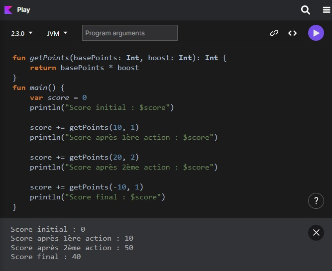
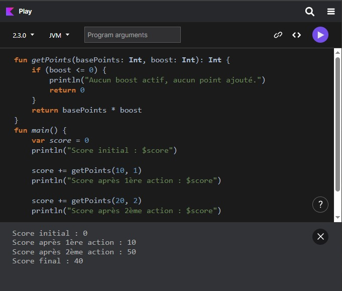
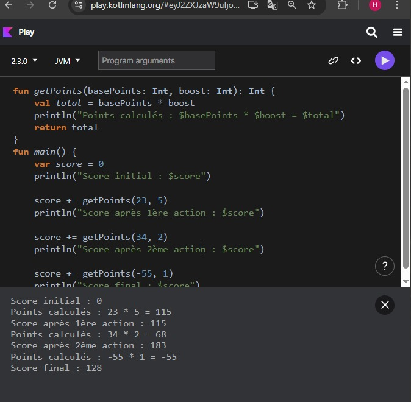

# 📘 Lab 4 — Fonctions avec paramètres et valeur de retour

## 📚 Cours
Fondamentaux de la programmation en Kotlin

---

## 🎯 Objectifs
- Créer et utiliser des fonctions en Kotlin
- Passer des paramètres à une fonction
- Retourner une valeur avec `return`
- Mettre à jour un score à partir d’une logique métier simple
- Suivre l’évolution du score à l’aide de `println`

### Résultat visuel

  
<em>Figure 1</em>
 

  
<em>Figure 2</em>
 

  
<em>Figure 3</em>
 

  
<em>Figure 4</em>
 

